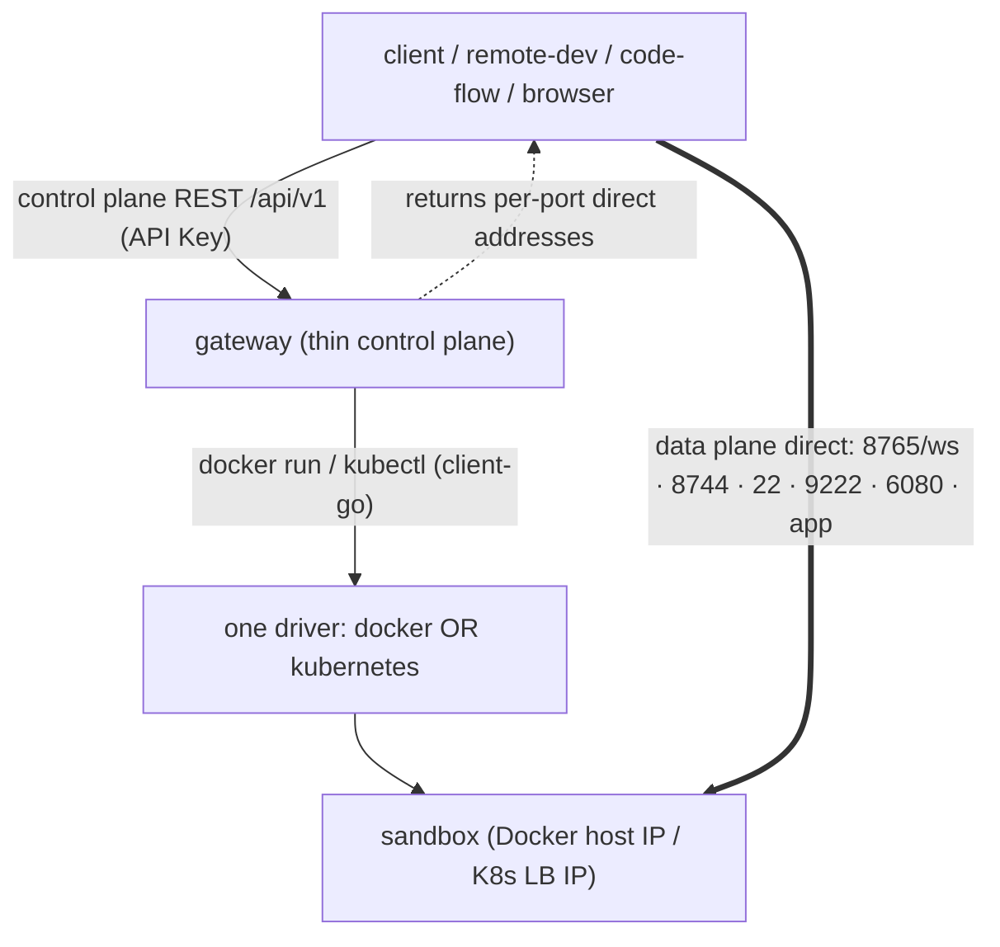

# Sandbox Gateway

A thin control-plane service that manages the lifecycle of sandboxes (instances
of the Phase 1 universal image in [`../sandbox`](../sandbox)) and returns the
client-reachable address for each exposed port.

The gateway deliberately does **not** proxy or handle data-plane traffic. All
data-plane operations are direct client-to-sandbox connections:

- session / agent bridge (WSP/1): `8765`
- code-server (web IDE): `8744`
- SSH (shell, exec, file transfer): `22`
- Chromium CDP: `9222`
- noVNC preview: `6080`

There is no gateway `exec`/`files`/`terminal` API and no reverse proxy: run
commands and move files over a direct SSH connection, and open the IDE/session
directly against the returned endpoints.

## Drivers (one per deployment)

A gateway instance runs exactly one driver, selected by `driver` in the config:

- `docker` — local testing. Publishes container ports on a host IP
  (`bindIP:ephemeral`) discovered via `docker inspect`.
- `kubernetes` — production. Creates a Deployment + PVC + Secret + ClusterIP
  Service, plus a `Type=LoadBalancer` Service. With MetalLB the gateway reads
  back the assigned external IP and exposes `lbIP:port` for each port.

Docker and Kubernetes are deployed separately and never run together in one
instance.



## Layout

```
gateway/
├── cmd/server/main.go          # config -> DB -> pick driver -> router -> serve + reconcile
├── config.example.yaml
├── internal/
│   ├── config/                 # YAML + SBGW_* overrides
│   ├── database/               # SQLite (glebarez) + AutoMigrate
│   ├── models/                 # Sandbox model (endpoints/env/labels as JSON columns)
│   ├── store/                  # GORM-backed metadata store
│   ├── driver/                 # Driver interface (lifecycle + Endpoints)
│   │   ├── docker/             # docker CLI driver
│   │   └── kubernetes/         # client-go driver + MetalLB LoadBalancer
│   ├── service/                # SandboxService: orchestrate driver+store, async finalize, reconcile
│   └── api/                    # Gin handlers + router + API-key middleware
└── docs/API.md
```

## Run (local, Docker driver)

```bash
cp config.example.yaml config.yaml
# edit config.yaml: set image.ref to your built universal-sandbox image
go run ./cmd/server -config config.yaml
```

Then:

```bash
# create
curl -s -XPOST localhost:8080/api/v1/sandboxes \
  -H 'Content-Type: application/json' \
  -d '{"env":{"ACP_BACKEND":"cursor"}}'

# poll until running, read endpoints
curl -s localhost:8080/api/v1/sandboxes/<id>

# connect directly (examples)
#   IDE:     open http://<ide-endpoint>
#   session: ws://<session-endpoint>/ws
#   shell:   ssh root@<ssh-host> -p <ssh-port>
```

Set `auth.apiKeys` (or `SBGW_API_KEYS=k1,k2`) to require
`Authorization: Bearer <key>` on `/api/v1/*`.

## Configuration

See [`config.example.yaml`](config.example.yaml). Every value can be overridden
by `SBGW_*` environment variables (env wins), e.g. `SBGW_DRIVER`,
`SBGW_LISTEN`, `SBGW_IMAGE`, `SBGW_API_KEYS`, `SBGW_DOCKER_BIND_IP`,
`SBGW_K8S_KUBECONFIG`, `SBGW_K8S_NAMESPACE`, `SBGW_K8S_ENABLE_LB`.

## API

See [`docs/API.md`](docs/API.md). The data-plane contract for the session port
is WSP/1, documented in [`../sandbox/docs/PROTOCOL.md`](../sandbox/docs/PROTOCOL.md).
